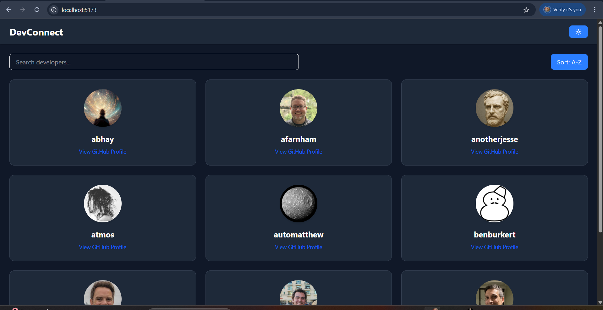
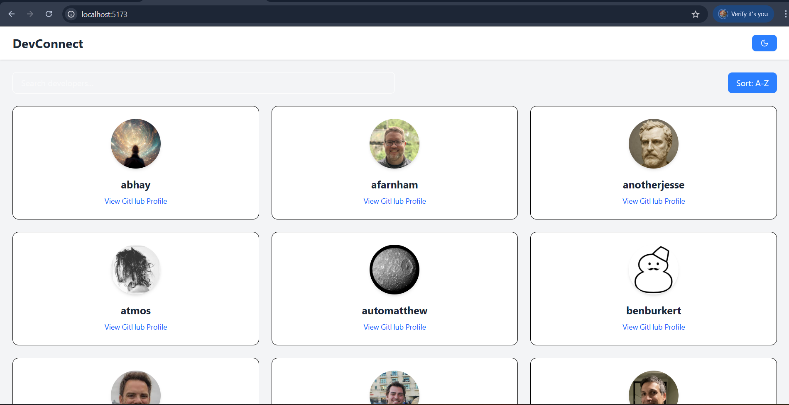

# DevConnect - Developer Portfolio Hub

**DevConnect** is a sleek and modern React application that showcases GitHub developer profiles in a beautifully paginated grid layout. Built with performance and user experience in mind, this project demonstrates advanced React skills, including API integration, state management, dynamic theming (dark mode), and modular component architecture.

---

## Features

- **Real-time GitHub User Fetching**
- **Dark Mode** toggle
- **Search** functionality
- **Sort** users alphabetically (A-Z / Z-A)
- **Pagination** with navigation controls
- **Responsive Design** (Mobile + Desktop)
- **Skeleton Loader** for seamless UI during API calls
- **Component-based architecture**
- **Clean code using Tailwind CSS**

---

## Tech Stack

- **ReactJS**
- **Tailwind CSS**
- **Axios** (for API requests)
- **Lucide-react** (icons)

---

## Installation

```bash
# 1. Clone the repo
https://github.com/yourusername/devconnect.git

# 2. Navigate into the directory
cd devconnect

# 3. Install dependencies
npm install

# 4. Run the app
npm run dev
```

---

## Folder Structure
```
src/
├── components/
│   ├── DeveloperCard.js
│   ├── Loader.js
│   ├── Navbar.js
│   └── Pagination.js
├── App.js
└── main.jsx
```

---

## API Used

GitHub Public Users API:
```
https://api.github.com/users?since=0&per_page=100
```

---

## Screenshots

*Dark Mode + Responsive Cards*
![screenshot-dark]

*Light Mode + Pagination & Search*
![screenshot-light] 

---

## Deployment

You can deploy this project for free using [Vercel](https://vercel.com) or [Netlify](https://netlify.com). Simply import the GitHub repository and deploy!

---

## Author

**Abhiram Kumar**  
Frontend Developer | React Enthusiast  
[LinkedIn](https://linkedin.com/in/abhiramkumar) | [GitHub](https://github.com/yourusername)

---

## License

This project is licensed under the MIT License.

